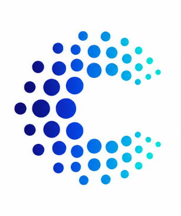

<div align="center">



# 🚀 Chennai Coder

### AI Solutions • Software Development • Technology Education

<p>
Building intelligent software for businesses while empowering the next generation of developers through practical, industry-focused training.
</p>

<p>
<a href="https://chennai-coder.vercel.app/">🌐 Website</a> •
<a href="https://chennai-coder.vercel.app/#courses">📚 Courses</a> •
<a href="https://chennai-coder.vercel.app/#contact">💼 Hire Us</a> •
</p>

</div>

---

## 🏢 About Chennai Coder

<p align="justify">

<b>Chennai Coder</b> is a technology company specializing in
<b>Artificial Intelligence</b>,
<b>Modern Software Development</b>,
and
<b>Professional Technology Education</b>.

We help businesses build scalable software products while enabling students to master programming through practical learning and real-world projects.

</p>

---

## 🚀 What We Do

<table>

<tr>

<td width="50%">

### 🤖 AI Solutions

- AI Assistants
- Generative AI
- AI Agents
- RAG Applications
- Prompt Engineering
- Computer Vision
- Business Automation
- Machine Learning

</td>

<td width="50%">

### 💻 Software Development

- Web Applications
- Backend APIs
- FastAPI
- Full Stack Development
- Database Design
- Cloud Deployment
- REST APIs
- Business Software

</td>

</tr>

</table>

---

## 🎓 Professional Training

<table>

<tr>
<td>🐍 Python</td>
<td>⚛ React</td>
<td>⚡ FastAPI</td>
</tr>

<tr>
<td>🗄 SQL</td>
<td>🤖 AI & ML</td>
<td>👁 Computer Vision</td>
</tr>

<tr>
<td>🧠 LLM Development</td>
<td>🔗 Git & GitHub</td>
<td>💻 Software Engineering</td>
</tr>

</table>

---

## ⭐ Why Choose Chennai Coder?

✔ Industry-Oriented Learning

✔ Practical Project-Based Training

✔ Real-World AI Applications

✔ One-to-One Mentorship

✔ Career Guidance

✔ Portfolio Development

✔ Interview Preparation

✔ Affordable Courses

✔ Continuous Learning Support

---

## 💻 Technology Stack

<details>

<summary><b>Programming Languages</b></summary>

- Python
- JavaScript
- TypeScript
- SQL
- HTML
- CSS

</details>

<details>

<summary><b>Artificial Intelligence</b></summary>

- OpenAI API
- LangChain
- Machine Learning
- Deep Learning
- RAG
- AI Agents
- Computer Vision
- Generative AI

</details>

<details>

<summary><b>Backend</b></summary>

- FastAPI
- Flask
- REST APIs

</details>

<details>

<summary><b>Frontend</b></summary>

- React
- Vite

</details>

<details>

<summary><b>Databases</b></summary>

- PostgreSQL
- MongoDB
- MySQL
- SQLite

</details>

---

## 📚 Learning Journey

```text
Learn
   │
   ▼
Practice
   │
   ▼
Build Projects
   │
   ▼
Launch Your Career
```

---

## 🎯 Who We Help

<table>

<tr>

<td align="center">

🎓

### Students

</td>

<td align="center">

💼

### Professionals

</td>

<td align="center">

🚀

### Startups

</td>

<td align="center">

🏢

### Businesses

</td>

</tr>

</table>

---

## 🌍 Vision

> To become one of India's leading AI, Software Development, and Technology Education companies by empowering learners and delivering innovative digital solutions.

---

## 🎯 Mission

> Helping businesses build intelligent software while preparing future software engineers through practical, industry-driven education.

---

## 📞 Connect With Us

<div align="center">

### 🌐 Chennai Coder

📧 chennaicoder.support@gmail.com

📱 +91 7395981362

🌍 https://your-domain.vercel.app

</div>

---

<div align="center">

# 🚀 Build AI

# 💻 Create Software

# 🎓 Learn Programming

### Empowering Students • Transforming Businesses

Made with ❤️ by **Chennai Coder**

</div>
